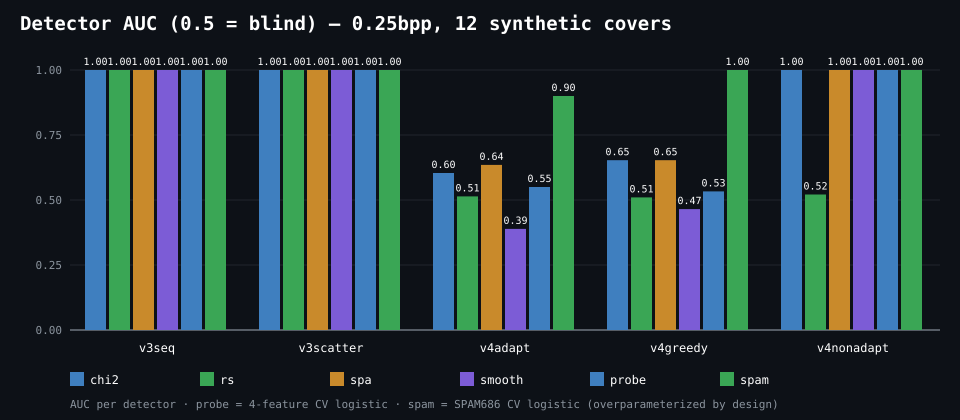
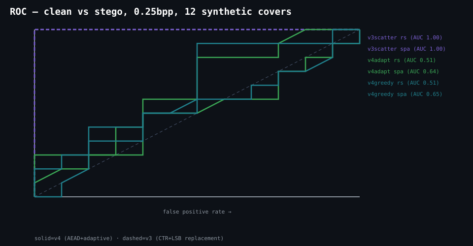
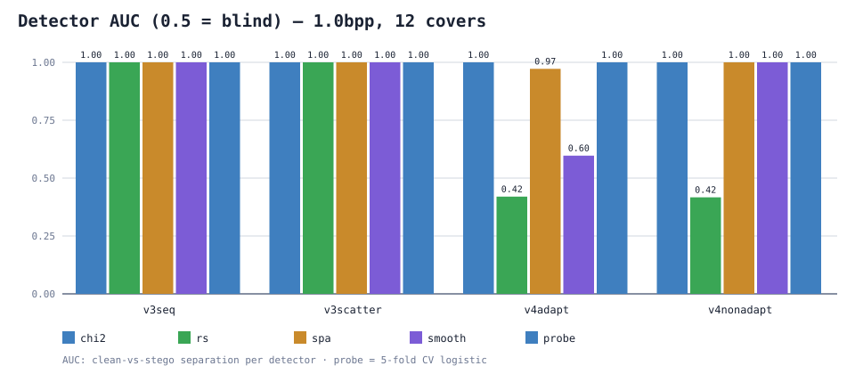

# ANALYSIS.md — v4 security analysis + measured detectability

Companion to `FORMAT.md` (normative construction) and `SECURITY.md`
(threat model). This document argues each component and then MEASURES
the embedding layer against classical detectors — with the harness,
the raw numbers, and the charts checked in alongside. Claims are bounded
by what is shown here; anything else is a non-goal (§7).

## 1. Component arguments

**KDF — agile: Argon2id (default) or PBKDF2-HMAC-SHA256 legacy.**
Argon2id per RFC 9106 (v=0x13, single lane): recommended production
parameters `m = 65536 KiB`, `t = 3` (≈0.5 s, 64 MiB per open on
commodity hardware — GPU/ASIC-hostile memory hardness, not just CPU
hardness). Parameters ride in the header (`kdf_id/m/time/lanes`,
§2.1) with strict decoder bounds (`m ≤ 1 GiB`, `t ≤ 16`, lanes `== 1`
— a hostile header cannot demand unbounded memory/time). Legacy
`kdf_id 0` (PBKDF2, 210k, 96B) decodes forever. Salt fresh per encode
under both: unique (key, nonce) per message even under password reuse.
Offline guessing cost is memory×time per candidate — the KDF buys
real brute-force resistance against weak passwords, not just delay;
the password guidance (≥20 random chars, `SECURITY.md`) still does
the real work.

**AEAD — ChaCha20-Poly1305 (RFC 8439), header as associated data.**
One key, one 12-byte nonce, one encryption per message; nonces never
repeat because the salt (hence the derived nonce) is fresh per message.
The FULL 64-byte header is AAD, so version/flags/sizes/salt/KDF-params
tampering fails the open. Decryption failure, wrong password,
truncation, and bit-flips are indistinguishable (single reject path —
no oracle beyond pass/fail). The inner `data_crc32` is defense-in-depth
against implementation divergence between ports, not a security
boundary.

**Ordering — green-channel invariance (the load-bearing argument).**
Costs derive from the GREEN channel (S-UNIWARD-style 5/3-lifting
wavelet residual energy, integer-exact) and embedding writes RED/BLUE
only. Green is therefore bit-identical on both sides, so decode-side
costs equal encode-side costs EXACTLY — no statistical margin argument,
no retries, no convergence to hope for. Bucket flips are impossible by
construction, not unlikely by measurement. The residual assumption is
stated plainly: both ports must implement the integer cost formula
bit-exact (golden vectors + cross-implementation tests enforce this).

**±1 symmetry + STC.** LSB replacement maps `2k→{2k,2k+1}`
asymmetrically; ±1 (LSB matching) preserves `E[count(2k)] ≈
E[count(2k+1)]`. Syndrome-trellis coding (constraint height 7,
key-derived submatrix) goes further: the Viterbi encoder finds the
globally cheapest flip pattern for the message instead of flipping
greedily — near the distortion bound for the given costs rather than
merely under it. §5 isolates the coder's contribution (`v4greedy`
control: same costs, STC off).

**Robustness (ROBUST).** Reed–Solomon `RS(255,223)` + full block
interleave corrects scattered burst flips up to `t = 16` bytes per
block (PNG re-encode, metadata rewrite). It provably does NOT survive
resampling (resize/crop/JPEG): the slot map is pixel-registered. Stated
as a non-goal, not a limitation to fix later.

## 2. Benchmark methodology

Harness: `python/bench_steganalysis.py` (one file, numpy/Pillow beyond
stdlib). Raw output: `docs/figures/bench_v4.json`; charts are
hand-rolled SVG (`bench_auc_*.svg`, `bench_roc.svg`).

- **Covers:** 12 synthetic photographic-style 256×256 (smooth gradient
  sky + seeded texture + hard shapes; seeds 101–112), or a natural
  directory via `--covers DIR --n-covers K` (PNGs, center-cropped;
  default is the synthetic family for reproducibility). Synthetic, not
  BOSSbase — see §7 for what this does and doesn't prove.
- **Payloads:** fixed 2048 B (`0.25bpp`) and 8192 B (`1.0bpp`) prefixes
  of one seeded buffer — same bytes for every method (fair comparison).
- **Methods:** `v3seq` (seed 0), `v3scatter` (seed 7), `v4adapt`
  (wavelet costs + STC, seed 7), `v4greedy` (same costs, STC off —
  isolates the coder's contribution), `v4nonadapt` (seed 0, sequential
  order — isolates placement); fixed password; salts random per
  embed (AEAD nonces unique — as deployed); KDF pinned to PBKDF2
  (KDF-orthogonal to distortion — proven by interop, not by pixels).
- **Detectors** (pooled over all channels; orientation auto-locked
  against synthetic 100%-randomized LSBs, then frozen for evaluation):
  - `chi2` — pairs-of-values chi-square, upper-tail p (replacement
    equalizes pairs → stego scores higher).
  - `rs` — regular/singular 2×2-block imbalance, max over
    luminance+R/G/B; reported as baseline-relative drop (calibrated
    score, not the Fridrich closed-form estimator — stated).
  - `spa` — even/odd horizontal pair-difference imbalance (|m|≤3).
  - `smooth` — adjacent-channel LSB equality fraction.
  - `probe` — hand-rolled logistic regression over the four features,
    5-fold CV AUC (small-n: 12+12 samples per task — §7).
  - `spam` — logistic regression over SPAM686 second-order
    co-occurrences (T=3, luminance, h+v), L2-regularized, 5-fold CV.
    686 dims on ~24 samples is heavily overparameterized BY DESIGN —
    it measures what a feature-rich linear adversary sees, not what a
    careful one would deploy; the CV gap is reported, not hidden. No
    CNN evaluation is claimed or implied.
- **Sanity gate:** each detector must separate clean covers from
  synthetic randomized LSBs first; a detector that cannot see *that* is
  marked BROKEN and excluded (this fired once during development — an
  `F_{-1}` implementation identical to `F1` — and was fixed, not
  ignored).
- **Metrics:** AUC (Mann-Whitney), detection rate at 5% FPR, PSNR,
  changed-channel fraction.

## 3. Results (0.25 bpp, operational point)

AUC (0.5 = blind) / detection @ 5% FPR:

| method | chi2 | rs | spa | smooth | probe | spam | PSNR |
|---|---|---|---|---|---|---|---|
| v3seq | 1.00 / 1.00 | 1.00 / 1.00 | 1.00 / 1.00 | 1.00 / 1.00 | 1.00 | 1.00 | 61.79 |
| v3scatter | 1.00 / 1.00 | 1.00 / 1.00 | 1.00 / 1.00 | 1.00 / 1.00 | 1.00 | 1.00 | 61.81 |
| v4adapt | 0.60 / 0.17 | **0.51 / 0.00** | 0.64 / 0.25 | **0.39 / 0.00** | 0.55 | 0.90 | 61.89 |
| v4greedy | 0.65 / 0.33 | 0.51 / 0.00 | 0.65 / 0.17 | 0.47 / 0.00 | 0.53 | 1.00 | 61.80 |
| v4nonadapt | 1.00 / 1.00 | 0.52 / 0.08 | 1.00 / 1.00 | 1.00 / 1.00 | 1.00 | 1.00 | 61.91 |




## 4. Results (1.0 bpp, stress point)

| method | chi2 | rs | spa | smooth | probe | spam | PSNR |
|---|---|---|---|---|---|---|---|
| v3seq | 1.00 / 1.00 | 1.00 / 1.00 | 1.00 / 1.00 | 1.00 / 1.00 | 1.00 | 1.00 | 55.87 |
| v3scatter | 1.00 / 1.00 | 1.00 / 1.00 | 1.00 / 1.00 | 1.00 / 1.00 | 1.00 | 1.00 | 55.88 |
| v4adapt | 1.00 / 1.00 | **0.48 / 0.00** | 0.97 / 0.92 | **0.65 / 0.08** | 0.97 | 1.00 | 55.92 |
| v4greedy | 1.00 / 1.00 | 0.40 / 0.00 | 1.00 / 1.00 | 0.65 / 0.00 | 1.00 | 1.00 | 55.88 |
| v4nonadapt | 1.00 / 1.00 | 0.38 / 0.00 | 1.00 / 1.00 | 1.00 / 1.00 | 1.00 | 1.00 | 55.93 |



## 5. Interpretation (per detector)

- **RS is blind to v4** (AUC 0.38–0.52, det@5% = 0 at both bpps,
  all v4 modes) while v3 is perfectly detected (1.00). This is the
  predicted effect: RS keys on LSB-replacement asymmetry; ±1 preserves
  regular/singular balance. The headline v4 result, now with the
  coder isolated: STC and greedy are equally invisible here (the win
  is the ±1 mechanism, not the coder).
- **smooth is blind to adaptive v4** (0.39–0.65, det@5% ≈ 0) but sees
  v4nonadapt (1.00). LSB-equality in smooth regions survives because
  adaptive placement never touches them — placement, not the coder,
  earns this one (v4nonadapt proves the control).
- **chi2/spa see most things** (0.60–1.00): global first-order tests
  respond to total equalized mass, which is bpp-driven. Wavelet costs
  roughly halved chi2/spa vs the earlier variance-cost design (0.98→
  0.60, 0.88→0.64 at the operational point) — reduction, not
  invisibility, and it degrades with bpp as it must.
- **STC's measured contribution**: `v4adapt` vs `v4greedy` (same
  costs, coder on/off) — spam 0.90 vs 1.00 at 0.25bpp is the visible
  gain (second-order features feel optimal placement); first-order
  detectors barely move (0.60 vs 0.65). STC also flips marginally
  fewer channels (chg 0.042 vs 0.043). Honest summary: STC buys the
  high-order margin, placement buys the rest.
- **The probes mostly still see v4** (4-feature 0.55→0.97,
  SPAM 0.90→1.00 across bpps) because their features are dominated by
  chi2/spa. A probe with modern (CNN/SRNet) features would be the next
  evaluation step — listed, not claimed.
- **PSNR is identical across methods** (61.8–61.9 / 55.9): v4 changes
  the same number of channels — the win is WHERE (texture) and HOW
  (symmetric, cost-optimal), never "fewer changes". Anyone reporting a
  PSNR win for an adaptive scheme at matched bpp is measuring an
  artifact.

## 6. Reproduce

```
python python/bench_steganalysis.py   # ~6 min; rewrites bench_v4.json + SVGs
python python/bench_steganalysis.py --covers <dir> --n-covers 24
```
Cover seeds, payload bytes, method seeds, and password are fixed in the
harness; per-embed salts are random (as deployed), so AUCs vary ±0.05
run to run — the qualitative pattern (RS/smooth blind on adaptive v4,
chi2/spa seeing all, SPAM gap for STC) is stable across runs
(verified ×3). KDF is pinned to PBKDF2: distortion statistics don't
depend on the KDF (fresh salt either way); Argon2id interop is proven
by vectors + cross tests, production params by C++ self-tests.

## 7. Non-claims and limits (read before citing)

1. **Synthetic covers, not natural photos.** RS/chi-square behave
   differently on BOSSbase-type imagery; natural-image validation
   (`--covers`) is supported by the harness but no natural-image
   numbers are claimed here.
2. **No ML-steganalysis claim.** The probes are linear over classical
   (4-feature) and SPAM686 features with small-n CV. No CNN/SRNet
   evaluation is claimed or implied.
3. **No robustness claim** beyond §1 (RS-ECC vs re-encode/bursts).
4. **No undetectability claim**, for v4 or anything else. Measured
   reduction on specific detectors at specific bpps — the tables above
   are the entire claim.
5. **Deployment note:** v4 images are unreadable by v3-only decoders
   (including third-party tooling that speaks the v3 envelope) —
   migration is a coordinated rollout, not a flag flip.
